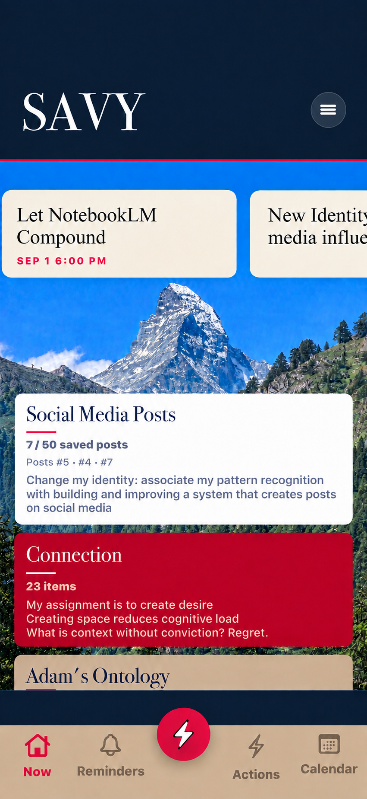

# Approved SAVY homepage visual — September 23, 2026

Adam approved this exact preview: "Yes, keep this version. I like this"

## Selected appearance

- Use Adam's mountain photograph as the landscape behind the homepage cards.
- Restore original deep navy `#08172D` behind the header and in the band directly above the tan bottom navigation.
- Add a thin full-width crimson `#E60E44` divider between the header and the landscape body; use the existing 1-point divider height in a native implementation.
- Retain the tan navigation, opaque cream/white/crimson/tan card faces, current typography, and existing card interactions.
- No decorative colored strips along card sides and no persistent pin icons.

## Files

- `approved-home.png`: exact generated preview Adam selected, preserved without modification.
- `mountain-original.jpeg`: exact original photograph Adam supplied, preserved without modification. Use this photograph for the app background, not a crop extracted from the generated preview.

## Delivery state

Implemented natively and installed on Adam's connected iPhone on September 23, 2026. The original photograph is bundled as `HomeMountainLandscape`. Home now has deep navy header/overscroll/navigation bands, the 1-point crimson divider, opaque existing cards, and an 80-point landscape reveal between carousel and destinations. Native 140-point carousel cards and existing interactions are retained. Other pages retain their prior styling.

The photograph's crop uses the viewport height rather than the total saved-card height, so content changes do not enlarge the mountain. The background stays behind the visible cards after the header scrolls away. Both the top-of-page and scrolled states were observed on the physical phone through QuickTime's wired screen preview after installation. `device-verification/installed-home.png` is the final top-of-page capture. The preview connection was closed afterward.
